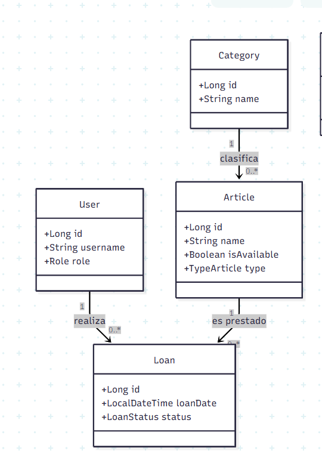

# 📚 Edulend  

Sistema para gestionar préstamos e inventario de recursos educativos en entornos académicos.

---

## 📖 Introducción / Contexto  

En entornos académicos es común el préstamo de computadores y libros educativos sin un sistema centralizado que permita llevar un control adecuado de disponibilidad, historial y estado de los recursos.  

La falta de trazabilidad puede generar pérdidas, uso ineficiente de los recursos y dificultades en la administración institucional.  

**EduLend** surge como una solución tecnológica que permite gestionar préstamos e inventarios de recursos educativos, asegurando un uso eficiente, controlado y organizado dentro de instituciones académicas.

---

## 🎯 Objetivos  

### ✅ Objetivo General  

Desarrollar una solución tecnológica para administrar préstamos e inventarios de recursos educativos, garantizando su disponibilidad y correcto uso.

### 🔹 Objetivos Específicos  

- Diseñar e implementar un sistema de gestión de usuarios con control de acceso.  
- Desarrollar un módulo de gestión de inventario para computadores y libros.  
- Implementar un sistema de registro y seguimiento de préstamos.  
- Permitir la consulta de disponibilidad y estado de los recursos en tiempo real.  
- Aplicar arquitectura hexagonal para garantizar mantenibilidad y escalabilidad del sistema.  

---

## 📦 Alcance del Proyecto (Scope)  

### ✔️ Qué se va a desarrollar  

- Gestión de usuarios (registro, autenticación y roles).  
- Gestión de categorías de recursos.  
- Gestión de inventario (libros y computadores).  
- Registro y control de préstamos.  
- API REST desarrollada con Spring Boot.  
- Arquitectura hexagonal por capas.  

---

### ❌ Fuera de alcance (por ahora)  

- Aplicación móvil nativa.  
- Integración con sistemas institucionales externos.  
- Sistema automatizado de multas o pagos.  
- Reportes avanzados con analítica compleja.  

---

## 🛠️ Tecnologías y Herramientas (Tech Stack)  

- **Backend:** Java + Spring Boot  
- **Arquitectura:** Hexagonal  
- **Frontend:** HTML, CSS, JavaScript  
- **Control de versiones:** Git  
- **Repositorio y alojamiento:** GitHub  

---

## 👥 Integrantes del Equipo  

| Nombre                  | Rol principal                    | Usuario GitHub    | 
|-------------------------|----------------------------------|-------------------|
| Wilder Garcia           | Backend / Arquitectura           |Wigek              | 
| Jean Medina             | Backend / Arquitectura           |Jcmedinah          |             
| Alejandra Alvarez       | Frontend                         |                   |
| Carlos Andres Perez     | Base de datos / Backend          |Andres0218         |           

---

## 🏗️ Arquitectura del Proyecto  

El backend está organizado siguiendo una **arquitectura hexagonal por capas**, lo que permite separar responsabilidades y mejorar la mantenibilidad del sistema.

Estructura general:
src/main/java/com/edulend

```
│
├── articles
│ ├── controllers
│ ├── datasource
│ ├── models
│ └── services
│
├── categories
│ ├── controllers
│ ├── datasource
│ ├── models
│ └── services
│
├── loans
│ ├── controllers
│ ├── datasource
│ ├── models
│ └── services
│
├── users
│ ├── controllers
│ ├── datasource
│ ├── models
│ ├── services
│ └── utils
│
├── config
│ └── SecurityConfig.java
│
└── EduLendApplication.java
```

### 🔎 Separación por capas

- **Models:** Entidades del dominio  
- **Services:** Lógica de negocio  
- **Controllers:** Adaptadores de entrada (API REST)  
- **Datasource:** Adaptadores de salida (persistencia)  
- **Config:** Configuraciones generales (seguridad, etc.)  

---

## 🧩 Diagrama de Clases del Dominio (v1)

  

*Diagrama inicial del modelo de dominio – versión 1. Se actualizará en futuras iteraciones.*
---

## 🚀 Instalación y Ejecución  

### 1️⃣ Clonar el repositorio

git clone https://github.com/wigek/inventario-edulend-grupo1.git

### 2️⃣ Ingresar al proyecto

cd edulend

### 3️⃣ Ejecutar la aplicación

mvn spring-boot:run

## Estado actual del proyecto 

Proyecto base inicializado - modelo de dominio V1 definido - Documentación inicial completa.
